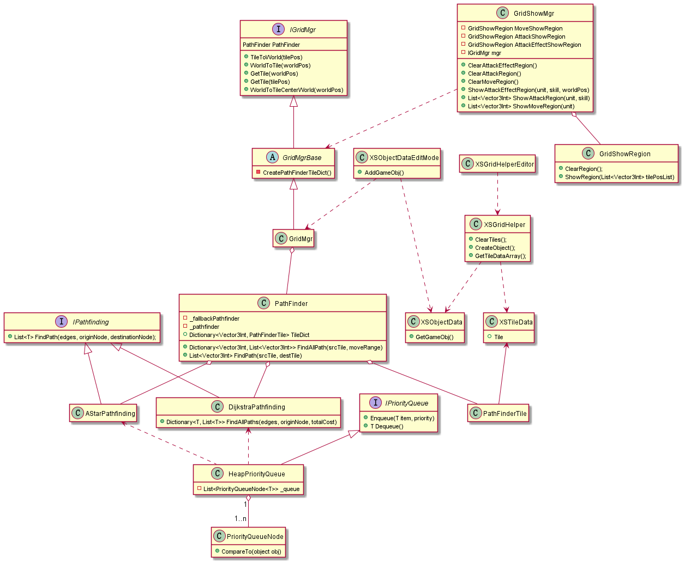

# 在代码中使用网格

在代码中主要通过GridMgr类来实现网格的网格坐标和世界坐标转换，网格属性获取，寻路等功能。此外XSObjectData实现了单位的简单封装，你可以获取在编辑器里的生成的单位，并获取他的坐标以及id等属性。

使用中重要的类有以下这些：

* [GridMgr](gridmgr.md)
* [PathFinder](pathfinder.md)(待补充)
* [XSObjectData](xsobjectdata.md)(待补充)

工程里全部类的uml类图：

